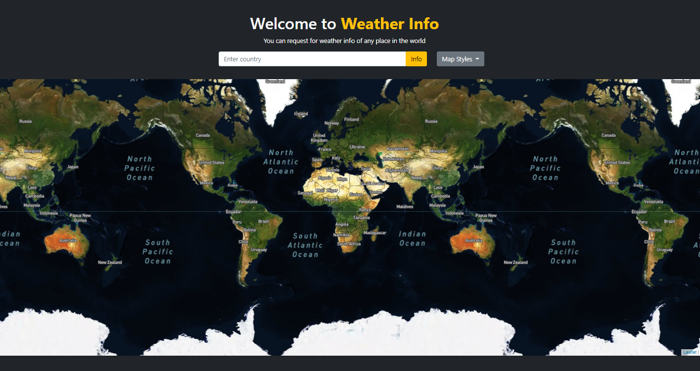

# weInfo
A single webpage gives weather information of places in the world. Use OpenWeather API and leaflet map package.

To run the webpage in your local computer:
* Clone the repository
* Go to the cloned directoty
* run `npm install`
* run `node app.js`
* Go to the browser: http://localhost:3000/

To require weather information:
* You can click anywhere in the map within the top right and bottom left boundaries to get weather information
* You can also jump to a specific country to see its weather information by entering its name

 

Reference link:
* OpenWeather API: https://openweathermap.org/
* Leaflet library: https://leafletjs.com/reference-1.7.1.html
